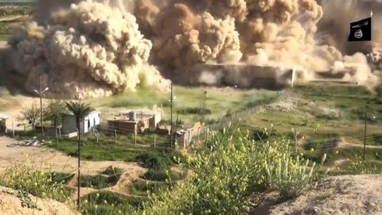

# Research Practicum 2019 – Research Plan 

> * Group Name: We Belong in a Museum
> * Group participants names: Cornell, Lincoln; Necaise, Aaron; Robkin, Jessica; Vaz, Karina
> * Project Title: Towards a Model for Predicting Overland Trafficking Routes

## Topic/Purpose Statement

This study addresses the viability of using computer simulations to identify the relationship between transportation networks and the smuggling of illicit antiquities. The purpose of this research is to provide a tool for law enforcement agencies and cultural heritage workers to recover looted archaeological artifacts before they reach the black market for sale. The first phase of this qualitative study will involve the running of weighted transportation simulations, guided by graph theory, to determine probable routes between selected archaeological sites that are known to have been looted during the 2014 ISIS insurgency in Syria and Iraq and known locations where caches of illicit artifacts have been recovered. The data from these simulations will be used to create a forced-decision survey designed to explore the routes that participants will select when informed of socio-political elements and available transportation networks.

## General Introduction

Throughout the Middle East and North Africa (MENA) region, organized criminal gangs have taken advantage of political instability to loot archaeological sites for the purpose of selling illicit antiquities to fund political insurgency and terrorist organizations (Terrill, 2007). While looting in these areas is a centuries-old practice (Luke & Kersel, 2005), advances in technology and a growing demand for antiquities from this region has caused a dramatic increase in these activites (Terrill, 2007).  

 

During the insurgency of Syria and Iraq by ISIS in 2014, the terrorist organization often televised the systematic destruction of what they termed “idolatrous” heritage. Using this as justification for the destruction of cultural heritage sites in the region, ISIS quietly looted these sites prior to their televised destruction, with the funds gained on the black market used to further support their effort (Terrill 2017). During this same time period, ISIS routinely issued permits to groups in the areas under their control, allowing for the looting of archaeological and cultural heritage sites, with the permittees sharing a portion of the black-market profits with ISIS in exchange for the right to keep some of the profits for themselves. The looting of these sites and the subsequent improvements to domestic and household structures in the areas bordering the sites has been observed through analysis of satelle imagery of these locations (Casana, 2015; Parcak, 2013). In the intervening years, while the presence of ISIS in the region has been marginalized, the looting of archaeological sites continues in the destabilized region (CITE). Oftentimes, the looting of these resources is not known until months after the fact, often seen by satellite imagery or when locals discuss their activities with archaeologists returning to some of the affected areas to continue their research (Casana, 2015; Proulx, 2013). 

  

The duel impact of the loss of cultural heritage and the monies gained from their sale are motivation to find methods to intercept stolen antiquities before they reach the black market. Understanding the methods of transportation that these groups utilize is essential to understanding how they are moving goods from the initial archaeological sites, through the countries, across the borders, and into safe houses where they could be held for decades before they are sold. 

Computer simulations offer an option for this research. By first understanding the transportation options available to smugglers, simulations can be informed which can provide reliable insight on the routes that smugglers would select when transporting illicit antiquities away from looted archaeological sites. Research into transnational smuggling indicates that when transporting illicit goods, smugglers will often transport goods overland following two methods, by hiding in plain sight and/or by moving with stealth (Basu, 2013; Basu, 2014). Following the idea that smugglers will make rational informed decisions when selecting these overland routes (Basu, 2014; Medel, 2015), this project has several aims: first, to use computer simulations to identify viable routes traffickers would use based on previous literature and the application of graph theory; second, to use this data to construct two qualitative surveys designed to provide insight into the decisions participants will make when provided information on road conditions, route circuity, faction-control, crime rates, and available alternative routes, as well as how they rank the importance of these factors; and finally, to use this data to inform a link-weighting system designed to produce the least-cost paths smugglers would likely select when faced with the same decisions and a rational mind.

  

In an attempt to aid cultural heritage workers, international NGO's, and local stakeholders, this project addresses the problem of illicit antiquities trafficking by using computer simulations to illuminate the relationship between existing transportation infrastructures and the paths criminals use to transport stolen antiquities from archaeological sites. We believe this project will provide proof of concept that computer simulations can reliably predict the routes that smugglers would select when they choose to hide in plain sight. 

#### Motivation

The looting of historical sites is both damaging to the cultural heritage of local communities and helping fund dangerous terrorist activity in the MENA region. While there has been a large amount of research focused on drug smuggling, little has addressed the issue of artifact smuggling. This research will address this gap in the literature and potentially have real-world impact on artifact smuggling.

#### Proposed Solution

The current project will utilize graph-theory to develop a series of routes within known smuggling networks. Our modeled smuggling network will take into account highly related factors like circuity and border security in order to generate routes with better validity than what can be achieved with shortest-path routing. A series of surveys and questionnaires will be used to gain additional insight about our model and smuggling behavior. The goal is for this model of smuggling to be extended to the MENA region where it can be used to predict artifact smuggling routes.

#### Hypotheses:

###### H1:
Incorporating region specific variables that are related to criminal behavior (faction borders, distance, crime rates, and route exposure) will lead to improved prediction of smuggling routes compared to a standard shortest-path approach. 

>> H1 Rationale: Based off previous literature, it is reasonable to believe that smugglers will take actions that help them blend in with civilians in order to avoid detection by authorities. However, in countries that are dealing with major geopolitical conflicts, standard shortest-path routes generated by a program like Google maps are not applicable. It can be difficult to predict the routes in a country with unstable infrastructure. Further, smugglers are likely to be more concerned with the presence of border security or enemy faction control in the region than they are of police presence. From this standpoint, incorporating regional specific information--like the circuity of a route or the presence of border security-- into a graph model for routing may lead to improved prediction of smuggling routes.

###### H2:
When forced to choose between competing routes, enemy faction presence will serve as the strongest deterrent towards route selection.

>> H2 Rationale: A major challenge for the current project will be validating our model against historical data. Currently, there are some documented drug smuggling routes that have been made public throughout Central and North America. These routes will be used as validation data for our model. However, drug smuggling routes may differ from artifact smuggling routes, and the drug smuggling route data is limited to begin with. Our plan is to administer a survey in which participants are asked to choose between several variations of a route. These variations will alter route characteristics like distance, faction presence, or border control.  We hope to analyze the choices made by participants to understand which variables--and to what extent these variables--contribute to common sense routing decisions. These results will also provide some insight into whether or not the routes generated by our model are realistic.

###### H3:
Geopolitical conflict will influence region-specific routes. 

>> H3 Rationale: One assumption that we are operating under is that smugglers will generally behave like ordinary citizens in order to lower their visibility to law enforcement. A concern is that--in countries with political instability--law enforcement may not serve as a detriment to smugglers if police corruption is an issue. Countries in the MENA region are dealing with drastically different political realities compared to those in Central America. To better understand how regional instability may influence smuggling and law enforcement behavior, we plan to distribute a qualitative survey to participants who have live(d) in those regions. This exploratory survey will provide insight in how smugglers may operate in those countries. 

#### Contributions:

•	Develop a methodology for predicting artifact smuggling routes that can be applied in the MENA region. 

•	Gain insight into smuggling behavior, including information on routing decisions and understanding the influence of geopolitical conflict on smuggling.

## Related Work / Literature Review

One obstacle for predicting the routes that looters take while transporting goods away from archeological sites is understanding how the political or geographical conditions of a region could influence the routing decisions made by smugglers. While looting in the MENA (Middle East and North Africa) region deserves unique considerations because of the activity’s relationship to terrorist groups, certain behaviors might hold true  across regions (Proulx, 2013).  From this perspective, understanding looting behavior at a global level could serve to inform our model for looting in the MENA region. 
  
There is some anecdotal evidence to suggest that looters often do not take precautions to avoid detection by archeologists or law officials after they have stolen historical goods (Proulx, 2013). In this study on regional attitudes towards looting,  Proulx (2013) found that the majority of archeological field-workers come into contact with looters while working. Further, nearly half of these field-workers have been solicited by looters to purchase back stolen goods. Data from this study was aggregated from historical sites located broadly throughout the world, which provides some insight on looting activity in MENA. However, this study does not help to explain routing behavior that is dependent on border customs and region-specific faction politics. 

Transporting illegal antiquities has it's own unique set of complications (proper handling, packaging, packing) (CITE), however the methods selected to transport these items over land shares many similarities with the trafficking of other illicit goods (Alderman, 2012; Basu; 2013, Basu, 2014). Understanding how these goods are moved over land is useful in informing our transportation models and selecting appropriate variables for study.  To further our understanding of how smugglers historically move illicit goods over land, a review of current research in the field of transnational smuggling was necessary. Transnational smugglers traditionally select two methods to move goods from destination to destination, moving either with stealth or blending in with traditional supply chain movements (Basu, 2013; Basu, 2014). Traffickers make these decisions in a rational way, looking to make the most profits with the fewest risks (Medel, Lu, & Chow, 2015). Medel et al. (2015) investigated the movement of drugs from Mexico into the United States, using crime data to inform transportation prediction models. For these models, an understanding of the mindset of the drug cartels was necessary. The movement of illicit goods requires planning and precision, with traffickers often making well-informed decisions about the routes they use, taking into consideration the political environments the goods must move through, the quality of available routes, and environmental concerns that may impact transport (Medel et al., 2015). Medel et al. (2015) use these factors in conjunction with socio-demographic and crime data to define their cost for moving drugs along the road networks in Mexico. This methodology will inform our own weighting criteria.
  
In finding the most likely path that smugglers may take, we are using graph theory to help predict the routes.  In graphing theory, vertices are points (also refered to as nodes) defined with edges that connect the vertices.  The edges can be unidirectional or bidirectional.  To use the graph theory to help in predicting the shortest route, the graph is modified to represent a geographic layout of a region, in our case the southern part of Mexico.  The vertices represent the cities that are along the various routes that the smugglers could take.  The edges represents the paths between the cities which are the major roadways that connect the cities.
  
In graph theory, each edge is also given a weighted value.  This allows the user to develop a criteria to assign these weights to the edges.  in our case the edge’s weighted value is determined by several factors.  In our research, the distance was not used as the weight of the edge.  Additional factors of criminal activity and population density (Medel et al., 2015) were included in the weighted values for the edges.  With the graph constructed, Dijkstra’s Algorithm (Rodríguez-Puente & Lazo-Cortés, 2013) will be used to determine the shortest path though the graph.  This will represent the best route, not based on distance, but based on lowest risk to the smuggler.  
  
## Research Method

As previously mentioned, the current project aims to address the lack of information surrounding smugglings routes in the MENA region by developing a model that can identify the most-likely long-distance pathways taken by smugglers. These pathways will consider attributes that are favorable for trafficking in addition to considering the standard least-distance/least-time approach. This will be the initial step in developing a more robust model that can be applied to the MENA region in future research. 
 
* First, using a similar approach as Medel (2015), a graph model will be created that considers distance, faction presence, crime rate, and route circuity. Based on the drug smuggling literature,  these regional crime statistics likely contribute to the routing decisions made by organized criminal networks. 

* Next, we will attempt to gauge the extent that each of these variables influence travel-patterns in the real world.  For this topic, two qualitative surveys will be administered to human subjects. The data gathered will be used to inform our model inputs as well as inform any future attempts to apply this methodology to problem areas in the MENA region. 

#### Participants

We anticipate drawing from two separate participant populations: one sample from the general college population and the other from participants living in the MENA region. For the college student sample, 30 undergraduate students (age 18+) will be recruited using the University of Central Florida's SONA research system. These students will be asked to complete a short questionnaire on routing decisions.

From the MENA region, 30 adults (18+) who live (or who have lived) in the region will be recruited through Facebook advertisement. It is expected that a portion of these participants will be nonrespondents due to the nature of the content on the survey. 

#### Materials

At current, two questionnaires have been developed to address [hypothesis 2](######h2:) and [hypothesis 3](######h3:). 

The first, the Route Decision Questionnaire, is composed of two major sections. In the first section, participants will be provided a brief historical context on the project and the issue of looting in the MENA region. Then, they will be asked to take on the perspective of a smuggler to rank the importance of our variables of interest (crime rate, faction presence, circuity, and distance traveled). The second section of the survey will present the participant with various routes and ask them to choose the route that they believe provides the strongest opportunity for success. Each of the 5 questions in this section will consists of 3 routes that have varying attributes related to the section 1 of the survey.

The second questionnaire, titled the Regional Influence Questionnaire, will be distributed to participants in the MENA region. This survey was developed to probe topics related to corruption and smuggling as they relate to our routing model. The survey consists of 10 structured-interview style questions will multiple choice response. The bottom of the survey will have a section for free-response comments.

#### Study plan and Procedure 

##### Routing Model

Drawing from the methods developed by Medel (2015), our graph model will be developed using a high-level overview of Central America. In the graph, nodes will represent major waypoints located throughout the region. These waypoints will consist of several dozen major cities, towns, and highway entrances. Using a qualitative approach, historical data will be gathered on the crime rate and criminal faction presence of that node's surrounding area. This data will be systematically applied to that nodes edges. 

Links between nodes will represent the pathway between major waypoints. As a base, these links will be given a value that corresponds to the distance between nodes. Then, this distance will be weighted by crime rate and faction presence of connected nodes. Once this network has been established, routing will be completed using Dijkstra's shortest path algorithm. Because the distance between nodes was weighed by our regional variables, this model will represent the path of least-cost.

##### Surveys

###### Route Decision Questionnaire

Participants recruited through SONA will be asked to fill out the questionnaire in a face-to-face session. The function of an in-person meeting is to ensure that any questions from the participant concerning this nuanced cultural issue can be fully addressed be researchers. After receiving a thorough briefing on the topic, participants will be allowed to complete the paper-based form in private. This questionnaire is not expected to take more than 15 minutes to complete. 

###### Route Decision Questionnaire

Participants will be recruited through Facebook and social media. Respondents who choose to participate will receive a link to fill out the survey through Google Forms. Study's completed in this manner are both convenient and anonymous. Survey completion will take no more than 10 minutes. 

## References

Alderman, K. L. (2012). Honor Amongst Thieves: Organized Crime and the Illicit Antiquities Trade. Indiana Law Review, 45, 27.

Basu, G. (2013). The role of transnational smuggling operations in illicit supply chains. Journal of Transportation Security, 6(4), 315–328. https://doi.org/10.1007/s12198-013-0118-y

Basu, G. (2014). The strategic attributes of transnational smuggling: Logistics flexibility and operational stealth in the facilitation of illicit trade. Journal of Transportation Security, 7(2), 99–113. https://doi.org/10.1007/s12198-013-0132-0

Casana, J. (2015). Satellite imagery-based analysis of archaeological looting in Syria. Near Eastern Archaeology, 78(3), 142–152.

Luke, Christina, and Morag Kersel. (2005). A Retrospective and a Look Forward. Journal of Field Archaeology, 30(2), 191-200.

Medel, M., Lu, Y., & Chow, E. (2015). Mexico’s drug networks: Modeling the smuggling routes towards the United States. Applied Geography, 60, 240–247. https://doi.org/10.1016/j.apgeog.2014.10.018

Parcak, Sarah, David Gathings, Chase Childs, Greg Mumford, and Eric Cline. (2016). Satellite Evidence of Archaeological Site Looting in Egypt: 2002–2013. Antiquity, 90(349), 188–205.

Proulx, B. B. (2013). Archaeological Site Looting in “Glocal” Perspective: Nature, Scope, and Frequency. American Journal of  Archaeology, 117(1), 111. https://doi.org/10.3764/aja.117.1.0111

Rodríguez-Puente, R., & Lazo-Cortés, M. S. (2013). Algorithm for shortest path search in Geographic Information Systems by using reduced graphs. SpringerPlus, 2(1). https://doi.org/10.1186/2193-1801-2-291

Terrill, W. Andrew. (2017). Antiquities Destruction and Illicit Sales as Sources of ISIS Funding and Propaganda. Carlisle, PA: U.S. Army War College. 
